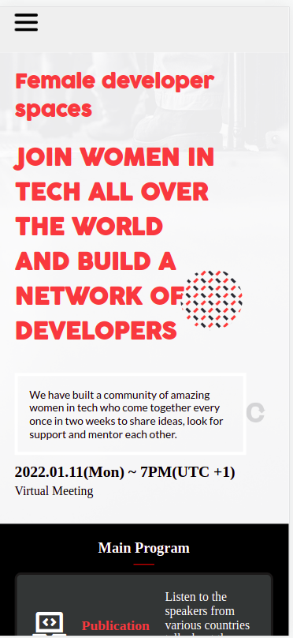

# SheCodes' Women's Conferance call

> This project is about women in the tech space. They have bi-monthly calls where we help each other find coding help, freelancing opportunities or just someone to talk to.

## Built With

- HTML
- CSS
- Javascript
- VScode

## Live Demo

For the link to the live demo, [Click here](https://ilynette.github.io/sheCodes-capstone/)

## Getting Started

To get a local copy up and running you just need to have a browser of your choice

## Authors

👤 **Author1**

- GitHub: [@githubhandle](https://github.com/iLynette)
- Twitter: [@twitterhandle](https://twitter.com/acholah_lynette)
- LinkedIn: [LinkedIn](https://www.linkedin.com/in/lynette-acholah/)

## 🤝 Contributing

Contributions, issues, and feature requests are welcome!

Feel free to check the [issues page](../../issues/).

## Show your support

Give a ⭐️ if you like this project!

## Acknowledgments

- Hat tip to anyone whose code was used
- Inspiration
- etc

## 📝 License

This project is [MIT](./MIT.md) licensed.
